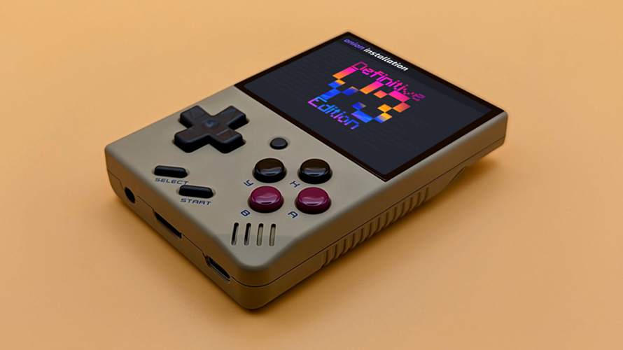

# Miyoo Mini Plus

Компактная игровая консоль с поддержкой популярных игровых платформ Dendy, Sega, GameBoy, PlayStation 1 и др.

## Характеристики

| Название             | Описание                                                |
| :------------------- | :------------------------------------------------------ |
| Процессор            | двухъядерный ARM Cortex-A7 dual-core 1.2G               |
| Оперативная память   | 128 MB                                                  |
| Внутренняя память    | свободной памяти нет, поддержка Micro SD до 128 GB      |
| Дисплей              | разрешение экрана 640x480, 3,5 дюйма, IPS, несенсорный  |
| Операционная система | Linux                                                   |
| Дополнительные опции | Wi-Fi, вибромотор, шифты L1/R1, L2/R2 на задней стороне |
| Аккумулятор          | 3.7V 3000mAh / зарядка 5V/1A                            |
| Размеры              | 108х78.5х22.3 мм                                        |
| Вес                  | 162 г                                                   |

## Часто задаваемые вопросы

**Чем версия V1 отличается от V2?** 
На данный момент существуют две версии устройства.
V1 – поставляется в картонной коробке, без защитного кейса, со съемной аккумуляторной батареей на 1900 мАч.
V2 – поставляется в защитном кейсе, с аккумуляторной батареей на 2000 мАч и ламинированным дисплеем.

**Какая комплектация?** 
В комплекте с консолью поставляется: карта памяти на 32 ГБ, USB TYPE-C кабель, USB-картридер, инструкция, защитный кейс (в версии v2).

**Время работы?** 
5-6 часов

**Чем заряжать консоль?** 
Рекомендуется использовать обычную зарядку на 5V, 1А. Можете также воспользоваться пауэрбанком (powerbank) без быстрой зарядки. Не используйте быструю зарядку (18, 33, 45, 65-67, 120W), так как это пагубно сказывается на АКБ и может вывести его из строя.

**Поддерживает ли Miyoo Mini карты памяти большого объёма - на 256 и 512 ГБ?** 
Да, карты памяти с данным объемом стабильно работают на ММ, но официально не заявлены в спецификациях.

**Есть ли Bluetooth, Wi-Fi, USB-OTG?** 
Нет.

**Может ли консоль работать без карты памяти?** 
Да, стандартная прошивка зашита в память консоли, однако, вы не сможете поиграть, так как все ромы (образы игр) хранятся на карте памяти.

**Как перезагрузить консоль, если она зависла?** 
Зажмите кнопку МЕНЮ + ПИТАНИЕ.
