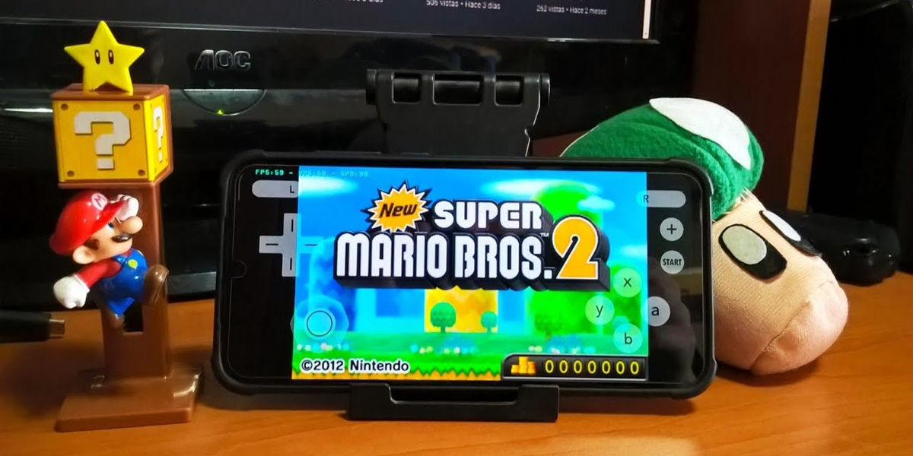
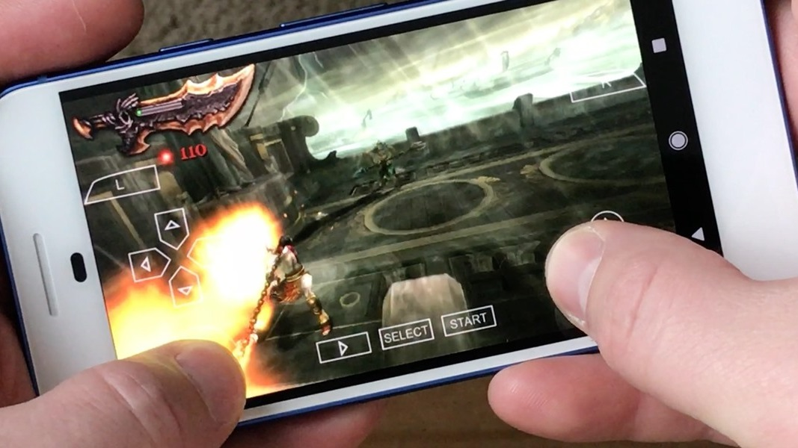
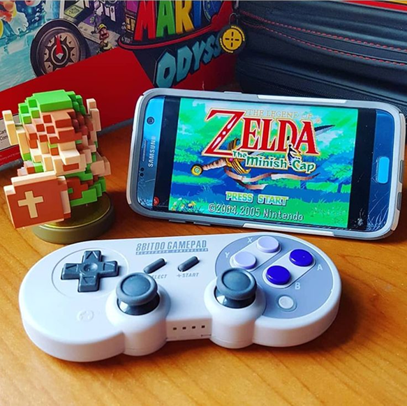
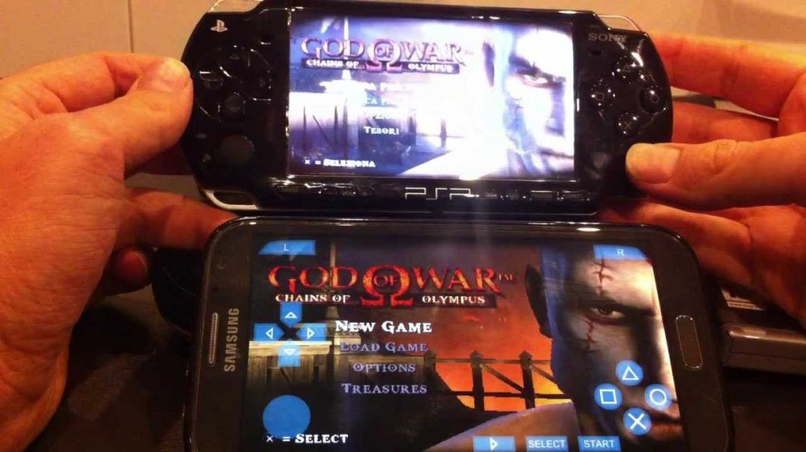

# Эмуляторы игровых консолей для Android

> Эмулятор игровых консолей для Android – это программа, которая позволяет запускать игры, предназначенные для старых игровых приставок (например, NES, SNES, PlayStation, PSP, Nintendo DS и др.), на смартфонах или планшетах под управлением ОС Android.

## Выбор эмулятора
Популярные эмуляторы для Android:

NES / Famicom → Nostalgia.NES, NES.emu

SNES → Snes9x EX+, SNES9x

Game Boy / GBA → My Boy!, Pizza Boy, John GBA

Nintendo DS → DraStic, MelonDS

PS1 → ePSXe, FPse, DuckStation

PSP → PPSSPP

Nintendo 64 → M64Plus FZ, N64 Emulator Pro

Dreamcast → Redream, Flycast

## Установка эмулятора ##

### Способ 1: Через Google Play
Откройте Google Play Маркет.

Введите название эмулятора (например, PPSSPP).

Нажмите "Установить".

### Способ 2: Вручную (APK-файл)
Если эмулятора нет в Google Play:

Скачайте APK с официального сайта (например, ppsspp.org).

Разрешите установку из "Неизвестных источников" (Настройки → Безопасность).

Запустите APK и установите эмулятор.

## Загрузка игр (ROM-файлов)
Эмулятору нужны ROM-файлы игр (обычно в формате .iso, .gba, .nds и т. д.). Их можно найти в интернете (например, на сайтах CoolROM, Emuparadise, CDRomance).

## Настройка эмулятора

### Добавление игр

Откройте эмулятор.

Укажите папку, где лежат ROM-файлы.

Игры появятся в списке.

### Настройка управления

Можно использовать сенсорные кнопки или геймпад (Bluetooth/USB).

В настройках эмулятора выберите "Управление" и переназначьте кнопки.

### Графика и производительность

Включите улучшение графики (если телефон мощный).

На слабых устройствах уменьшите разрешение и отключите сглаживание.

### Дополнительно

* Используйте геймпад для удобства (Xbox, PS4, 8BitDo).
* Сохраняйтесь через встроенные слоты сохранения эмулятора.