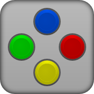

# Эмуляторы игровых консолей для Android

> Эмулятор игровых консолей для Android – это программа, которая позволяет запускать игры, предназначенные для старых игровых приставок (например, NES, SNES, PlayStation, PSP, Nintendo DS и др.), на смартфонах или планшетах под управлением ОС Android.

## NES

Эмулятор NES/Famicom основанный на исходном коде FCEUX 2.1.6-svn (GPL), разработан и протестирован на Droid/Milestone, Xoom, Xperia Play, но будет работать и на других устройствах с подобными характеристиками. Приложение основано на последней актуальной версии эмулятора FCEUX (большинство других приложений в Маркете используют более старые и менее точные версии FCE Ultra).

Особенности:
* Поддержка сохранений, автосохранение и десять слотов для ручного сохранения. Файлы сохранений из FCEUX будут работать на NES.emu и наоборот.
* Поддержка игр в формате .nes и .unf, а так-же в .zip архивах
* Эмулятор Famicom Disk System использует игры в формате .fds (Для работы выберите BIOS файл в настройках)
* Поддержка VS UniSystem, нажмите старт для имитации монетки
* Поддержка чит кодов совместимых с FCEU (расширение .cht)
* Поддержка светового пистолета Zapper/Gun, касайтесь экрана для имитации выстрелов, нажмите и держите за пределами экрана для имитации выстрела за пределы экрана.
* Настраиваемая наэкранная клавиатура и поддержка физических клавиш (до 3 нажатий на экран одновременно), оптимизированное расположение кнопок для Xperia Play
* Поддержка мультиплеера, Wiimote + Classic Controller, iControlPad, и Zeemote JS1 (не требуется установка дополнительных приложений, посетите веб-сайт для просмотра подробных инструкций)

Скачать: 

## Snes9x EX+

* Точная эмуляция и высокая степень совместимости, используется Snes9x 1.4.32
* Поддержка резервного копирования памяти и сохранения состояний, автоматическое сохранение и десять ручных слотов для сохранения состояний. Файлы состояния из Snes9x 1.4.32 должны работать на Snes9x EX, и наоборот.
* Поддерживает игры в форматах .smc, .sfc, .fig и .1, при необходимости в zip-файлах.
* Поддержка Super Scope, сенсорного экрана для стрельбы, сенсорного экрана за пределами экрана для нажатия кнопки курсора
* Поддержка мыши, инструкции смотрите ниже
* Настраиваемое экранное мультитач-управление и поддержка клавиатуры (для мультитач-управления требуется Android 2.1+)
* Поддержка многопользовательской игры Wiimote + Classic Controller и iControlPad
* Поддержка портретной / альбомной ориентации (автоматическая ориентация на Android)

Скачать: 