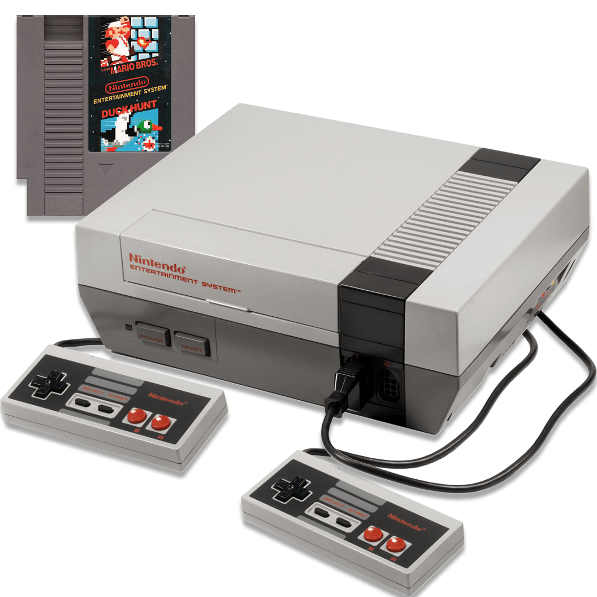
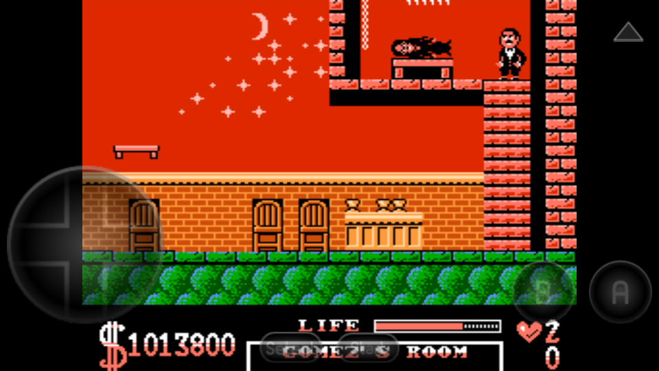
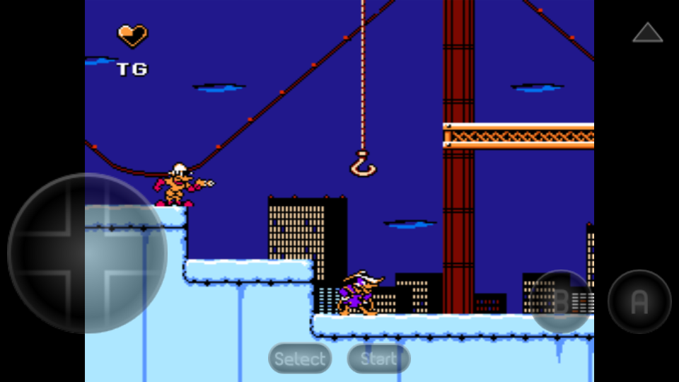
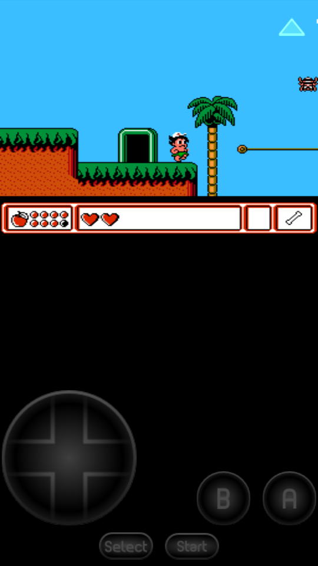
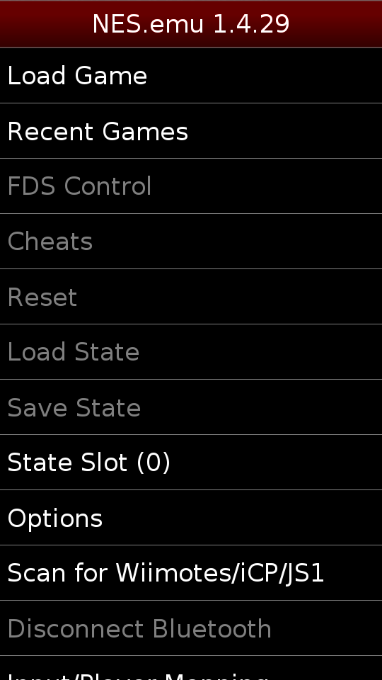
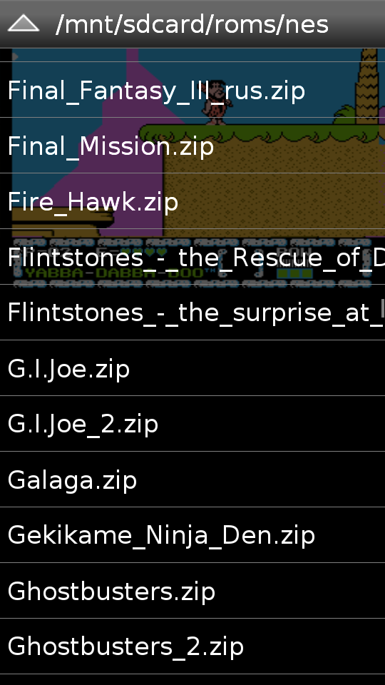

# NES

**NES (Nintendo Entertainment System)** — 8-битная игровая консоль, выпущенная Nintendo в 1983 году в Японии под названием Famicom, а в 1985 — в США и Европе. Она стала одной из самых популярных приставок своего времени, во многом благодаря таким играм, как Super Mario Bros., The Legend of Zelda и Metroid. NES использовала картриджи в качестве носителей, обладала скромными техническими характеристиками (1,79 МГц процессор, 2 КБ ОЗУ), но предлагала яркую для своего времени графику и запоминающийся звук. Консоль помогла возродить игровую индустрию после кризиса 1983 года и продалась тиражом более 60 млн экземпляров. Для неё также выпускались периферийные устройства, например, световой пистолет Zapper для игр вроде Duck Hunt. Сегодня игры NES можно запускать на смартфонах через эмуляторы, такие как Nostalgia.NES или NES.emu.

**Эмулятор NES/Famicom** основанный на исходном коде FCEUX 2.1.6-svn (GPL), разработан и протестирован на Droid/Milestone, Xoom, Xperia Play, но будет работать и на других устройствах с подобными характеристиками. Приложение основано на последней актуальной версии эмулятора FCEUX (большинство других приложений в Маркете используют более старые и менее точные версии FCE Ultra).

**Особенности:**
* Поддержка сохранений, автосохранение и десять слотов для ручного сохранения. Файлы сохранений из FCEUX будут работать на NES.emu и наоборот.
* Поддержка игр в формате .nes и .unf, а так-же в .zip архивах
* Эмулятор Famicom Disk System использует игры в формате .fds (Для работы выберите BIOS файл в настройках)
* Поддержка VS UniSystem, нажмите старт для имитации монетки
* Поддержка чит кодов совместимых с FCEU (расширение .cht)
* Поддержка светового пистолета Zapper/Gun, касайтесь экрана для имитации выстрелов, нажмите и держите за пределами экрана для имитации выстрела за пределы экрана.
* Настраиваемая наэкранная клавиатура и поддержка физических клавиш (до 3 нажатий на экран одновременно), оптимизированное расположение кнопок для Xperia Play
* Поддержка мультиплеера, Wiimote + Classic Controller, iControlPad, и Zeemote JS1 (не требуется установка дополнительных приложений, посетите веб-сайт для просмотра подробных инструкций)

**Скриншоты**

[Скачать](https://mobdisc.com/fdl/6330f6ea-15e4-42bf-a042-efdcf1d359aa/NES.emu-v1-5-81.apk)