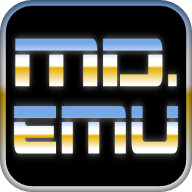

# Sega Mega Drive

**Sega Mega Drive** (известная как **Sega Genesis** в Северной Америке) — 16-битная игровая консоль, выпущенная компанией Sega в 1988 году в Японии, а в 1989–1990 годах — в других регионах. Она стала главным конкурентом SNES в «войне консолей» 1990-х и прославилась высокой скоростью процессора (7,6 МГц против 3,58 МГц у SNES), что делало её особенно подходящей для динамичных игр, таких как платформеры и файтинги.

Ключевой особенностью Mega Drive была серия игр про Sonic the Hedgehog, созданная как ответ Mario от Nintendo — быстрый геймплей и фирменный стиль Sonic стали визитной карточкой консоли. Среди других культовых игр — Streets of Rage, Golden Axe, Phantasy Star IV, Shinobi III и Mortal Kombat (в версии без цензуры, в отличие от SNES).

Консоль поддерживала дополнительные периферийные устройства, такие как Sega CD (CD-приставка) и Sega 32X (апгрейд до 32-бит), но они не стали массово успешными. Всего было продано около 30–40 млн экземпляров Mega Drive.

Сегодня игры для Sega Mega Drive можно запускать на Android через эмуляторы: **MD.emu**, **Genesis Plus** или **RetroArch** с соответствующим ядром.

**Эмулятор Sega Genesis/Mega Drive, Sega CD, и Master System/Mark III** основан на исходных кодах Genesis Plus/Gens/Picodrive (GPL), разработан и проверен на Motorola Xoom, Galaxy S2, и Xperia Play, но будет работать на многих устройствах с подобными характеристиками. Благодаря высокоточной эмуляции MD.emu выводит на дисплей графику в таких играх как Panorama Cotton, Star Control, и в режиме VS в игре Sonic 2. Поддержка Sega CD находится в стадии бета тестирования, пожалуйста сообщайте обо всех замеченных ошибках.

* Очень точная эмуляция звука с качественной дискретизацией
* Поддержка чипа SVP в Virtua Racing (необходимо быстрое устройство)
* Эмуляции SEGA CD, поддерживаются форматы CUE или TOC+BIN (требуются BIOS файлы для каждого из регионов USA/Japan/Europe)
* Файлы CUE поддерживают аудио треки в форматах Ogg Vorbis и Wav (PCM, ADPCM, и т.д.)
* Поддержка 6-ти кнопочного контроллера и адаптера на 4 порта
* Поддержка световых пистолетов (Menacer и Justifier)
* Поддержка чит кодов с использованием файлов формата .pat (как в Kega Fusion, Gens, Genesis Plus GX, и т.д.)
* Поддержка сохранений, автосохранение и десять слотов для ручного сохранения.
* Поддержка игр в форматах .bin, .smd, .gen, .sms, а так-же в .zip архивах (именно в zip, не в 7z, не в 7zip и уж тем более не в rar!)
* Настраиваемая наэкранная клавиатура и поддержка физических клавиш (до 4 нажатий одновременно), оптимизированное расположение кнопок для Xperia Play
* Мультиплеер с использованием контроллеров Wiimote + Classic Controller, iControlPad, и Zeemote JS1 (не требуется установка дополнительных приложений, посетите веб-сайт для просмотра подробных инструкций)

**Скриншоты**

[Скачать](https://mobdisc.com/fdl/a104a34e-5638-4a56-8e8c-cb576e1048df/MD-emu-v1-5-82-v8a.apk)