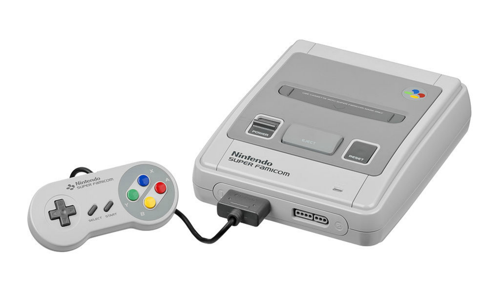
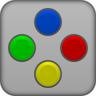
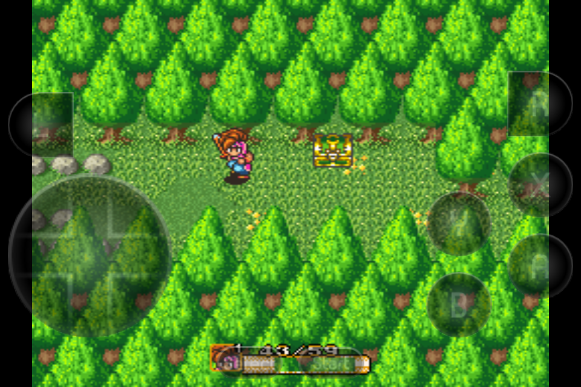
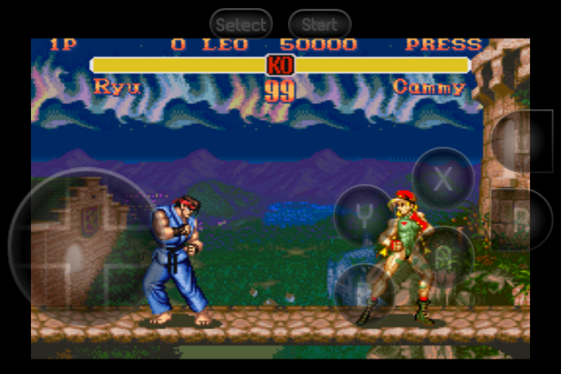

# SNES

**SNES (Super Nintendo Entertainment System)** — 16-битная игровая консоль от Nintendo, выпущенная в 1990 году в Японии и в 1991–1992 годах в других регионах. Она стала преемником NES и одним из главных игровых устройств 90-х, известным благодаря улучшенной графике, стереозвуку и культовым играм. В отличие от конкурентов вроде Sega Mega Drive, SNES использовала более продвинутые аудио- и видеочипы, что позволяло создавать красочные и детализированные игры с насыщенным саундтреком.

Среди самых знаменитых игр для SNES — Super Mario World, The Legend of Zelda: A Link to the Past, Super Metroid, Chrono Trigger, Donkey Kong Country и Street Fighter II Turbo. Консоль поддерживала дополнительные чипы в картриджах (например, Super FX), что расширяло её возможности. Всего было продано более 49 млн экземпляров SNES.

Сегодня игры для SNES можно запускать на Android через эмуляторы, такие как **Snes9x EX+**, **SuperRetro16** или **John SNES**.

## Snes9x EX+

**Особенности**

* Точная эмуляция и высокая степень совместимости, используется Snes9x 1.4.32
* Поддержка резервного копирования памяти и сохранения состояний, автоматическое сохранение и десять ручных слотов для сохранения состояний. Файлы состояния из Snes9x 1.4.32 должны работать на Snes9x EX, и наоборот.
* Поддерживает игры в форматах .smc, .sfc, .fig и .1, при необходимости в zip-файлах.
* Поддержка Super Scope, сенсорного экрана для стрельбы, сенсорного экрана за пределами экрана для нажатия кнопки курсора
* Поддержка мыши, инструкции смотрите ниже
* Настраиваемое экранное мультитач-управление и поддержка клавиатуры (для мультитач-управления требуется Android 2.1+)
* Поддержка многопользовательской игры Wiimote + Classic Controller и iControlPad
* Поддержка портретной / альбомной ориентации (автоматическая ориентация на Android)

**Скриншоты**

[Скачать](https://mobdisc.com/fdl/94848af7-083e-4795-ba31-7885b1c2088f/Snes9x-EX-1.5.59.apk) 