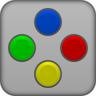

# Snes9x EX+

* Точная эмуляция и высокая степень совместимости, используется Snes9x 1.4.32
* Поддержка резервного копирования памяти и сохранения состояний, автоматическое сохранение и десять ручных слотов для сохранения состояний. Файлы состояния из Snes9x 1.4.32 должны работать на Snes9x EX, и наоборот.
* Поддерживает игры в форматах .smc, .sfc, .fig и .1, при необходимости в zip-файлах.
* Поддержка Super Scope, сенсорного экрана для стрельбы, сенсорного экрана за пределами экрана для нажатия кнопки курсора
* Поддержка мыши, инструкции смотрите ниже
* Настраиваемое экранное мультитач-управление и поддержка клавиатуры (для мультитач-управления требуется Android 2.1+)
* Поддержка многопользовательской игры Wiimote + Classic Controller и iControlPad
* Поддержка портретной / альбомной ориентации (автоматическая ориентация на Android)

Скачать: 