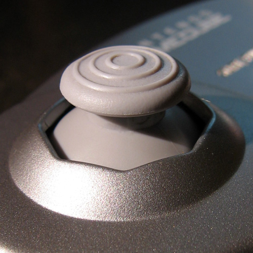
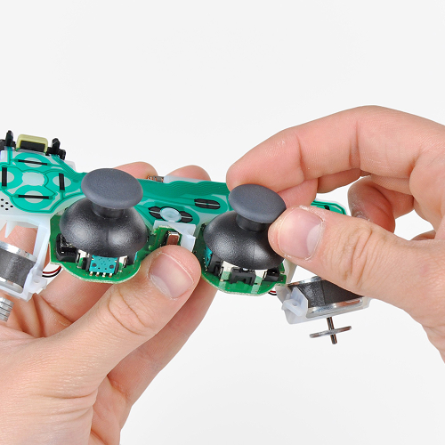
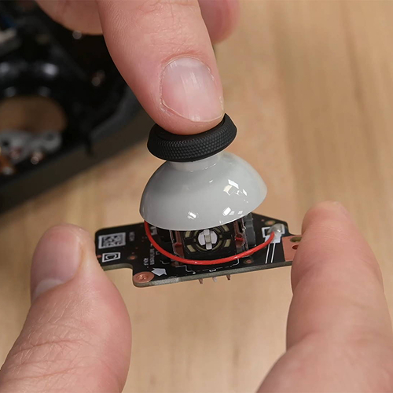
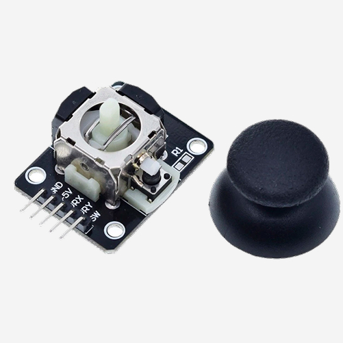
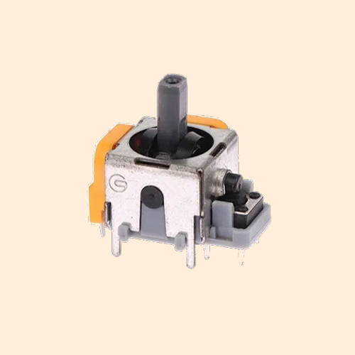
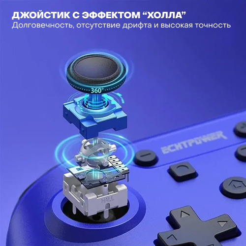

# Замена стиков для PlayStation, XBox и Nintendo

**Аналоговый стик (англ. analog stick)** — это устройство управления (в частности, управления играми), чья подвижность ограничена двумя степенями свободы. Альтернативный англоязычный термин thumbstick (thumb — большой палец; stick — рукоятка), указывает на функциональную зависимость от больших пальцев рук.

Производим замену стандартных стиков на долговечные с "эффектом Холла". Использование магнитных датчиков вместо традиционных механических контактных потенциометров делает данные стики более долговечными и точными, без риска появления дрифта (явление, когда персонаж или камера перемещаются произвольно). Заменяем стики для всех актуальных консолей - PlayStation 4/5, XBox Series, Nintendo Switch.